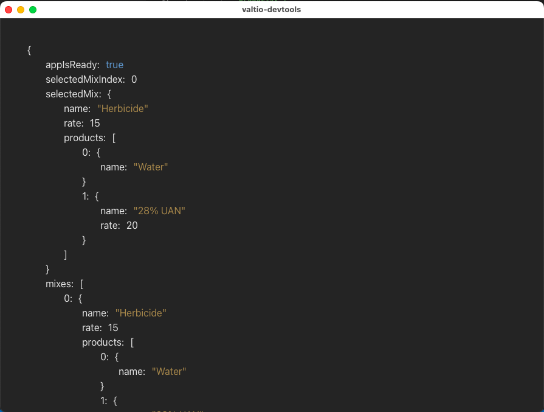

## valtio-devtools

A simple state viewer for [valtio](https://valtio.pmnd.rs/docs/introduction/getting-started) web/expo apps.

## Usage

`npx valtio-devtools`

## App Usage

    import { proxy } from  'valtio'
    import devtools from 'valtio-devtools-client'

	const  state = proxy({
		 foo: true,
		 bar: false
	})
	const devtoolOptions = {
		host: 'localhost' //default
		
		//Configure host automatically with `babel-plugin-ip-address`
		remote: false //default
	}
    devtools(state, options)

## Future Features (Hopefully)

- Able to run on different port number
	- command line arg
	- or ability to change port via UI
- Able to connect more than one web app on different tabs
- Pause / step through state changes
- "Manual Mode"
	- Watch changes on only object branches user selects
	- or ignore changes on object branches user chooses to ignore
- Show a list (description) of state changes with time elapsed in-between
- Performance improvements